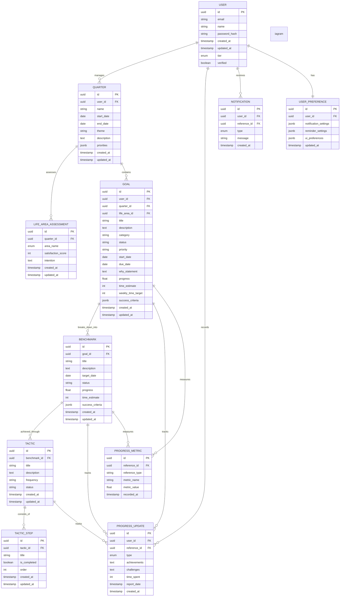

# ERD

Entity Relationship Diagram.

```mermaid
erDiagram
    USER {
        uuid id PK
        string email
        string name
        string password_hash
        timestamp created_at
        timestamp updated_at
		enum tier
        boolean verified
    }

    QUARTER {
        uuid id PK
        uuid user_id FK
        string name
        date start_date
        date end_date
        string theme
        text description
        jsonb priorities
        timestamp created_at
        timestamp updated_at
    }

    LIFE_AREA_ASSESSMENT {
        uuid id PK
        uuid quarter_id FK
        enum area_name
        int satisfaction_score
        text intention
        timestamp created_at
        timestamp updated_at
    }

    GOAL {
        uuid id PK
        uuid user_id FK
        uuid quarter_id FK
        uuid life_area_id FK
        string title
        text description
        string category
        string status
        string priority
        date start_date
        date due_date
        text why_statement
        float progress
        int time_estimate
        int weekly_time_target
        jsonb success_criteria
        timestamp created_at
        timestamp updated_at
    }

    BENCHMARK {
        uuid id PK
        uuid goal_id FK
        string title
        text description
        date target_date
        string status
        float progress
        int time_estimate
        jsonb success_criteria
        timestamp created_at
        timestamp updated_at
    }

    TACTIC {
        uuid id PK
        uuid benchmark_id FK
        string title
        text description
        string frequency
        string status
        timestamp created_at
        timestamp updated_at
    }

    TACTIC_STEP {
        uuid id PK
        uuid tactic_id FK
        string title
        boolean is_completed
        int order
        timestamp created_at
        timestamp updated_at
    }

    PROGRESS_UPDATE {
        uuid id PK
        uuid user_id FK
        uuid reference_id FK
        enum type
        text achievements
        text challenges
        int time_spent
        timestamp report_date
        timestamp created_at
    }

    PROGRESS_METRIC {
        uuid id PK
        uuid reference_id FK
        string reference_type
        string metric_name
        float metric_value
        timestamp recorded_at
    }

    NOTIFICATION {
        uuid id PK
        uuid user_id FK
        uuid reference_id FK
        enum type
        string message
        timestamp created_at
    }

    USER_PREFERENCE {
        uuid id PK
        uuid user_id FK
        jsonb notification_settings
        jsonb reminder_settings
        jsonb ui_preferences
        timestamp updated_at
    }

    USER ||--o{ QUARTER : "manages"
    QUARTER ||--o{ LIFE_AREA_ASSESSMENT : "assesses"
    QUARTER ||--o{ GOAL : "contains"
    GOAL ||--o{ BENCHMARK : "breaks_down_into"
    BENCHMARK ||--o{ TACTIC : "achieved_through"
    TACTIC ||--o{ TACTIC_STEP : "consists_of"
    USER ||--o{ PROGRESS_UPDATE : "records"
    GOAL ||--o{ PROGRESS_UPDATE : "tracks"
    BENCHMARK ||--o{ PROGRESS_UPDATE : "tracks"
    TACTIC ||--o{ PROGRESS_UPDATE : "tracks"
    GOAL ||--o{ PROGRESS_METRIC : "measures"
    BENCHMARK ||--o{ PROGRESS_METRIC : "measures"
    USER ||--o{ NOTIFICATION : "receives"
    USER ||--|| USER_PREFERENCE : "has"iagram

```
